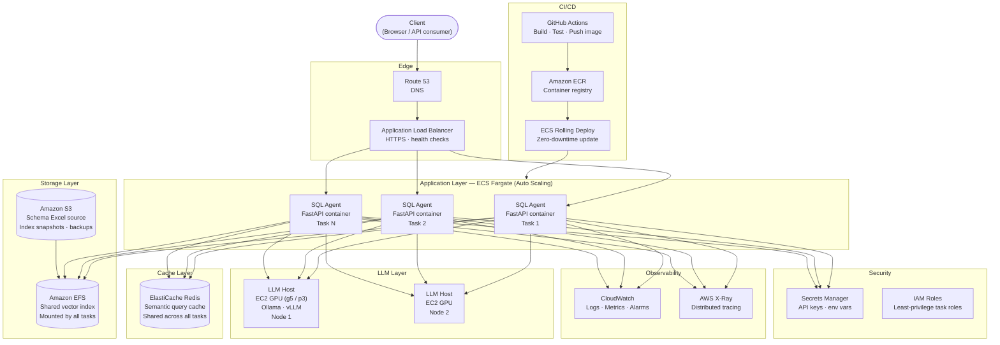
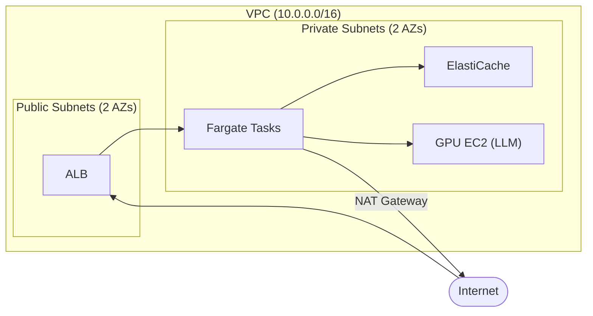

# SQL Agent — AWS Production Deployment Architecture

---

## Component Decisions

| Component | AWS Service | Why |
|---|---|---|
| DNS | Route 53 | Latency-based routing; health-check failover |
| Load balancer | ALB | Distributes requests across Fargate tasks; TLS termination; health checks |
| App runtime | ECS Fargate | No server management; scales tasks in/out automatically |
| Shared cache | ElastiCache Redis | Replaces file-backed cache; safe for multi-task concurrent writes; supports semantic cache via Redis VSS |
| LLM backend | EC2 GPU (g5/p3) | Self-hosted LLM (Ollama / vLLM); keeps data on-prem; swap for Bedrock if managed is preferred |
| Vector index | Amazon EFS | Shared read-only mount across all Fargate tasks; index rebuilt to S3 then synced |
| Schema source | Amazon S3 | Durable schema Excel storage; triggers re-index on upload via S3 event → Lambda |
| Logs & metrics | CloudWatch | Structured log ingestion from stdout; alarms on error rate / latency |
| Tracing | AWS X-Ray | Per-request latency breakdown across nodes |
| Secrets | Secrets Manager | LLM API keys, Redis credentials injected at task startup |
| Container registry | ECR | Private image storage; image scanning on push |
| CI/CD | GitHub Actions + ECR + ECS | Push to `main` → build image → push ECR → rolling deploy with zero downtime |

---

## Scaling Notes

- **App tier**: ECS Service Auto Scaling on CPU / request count — scale out task count, not instance size.
- **LLM tier**: GPU instances are expensive; scale with a target-tracking policy on GPU utilisation or queue depth. Consider a request queue (SQS) in front of the LLM pool for burst smoothing.
- **Cache**: Redis single-node for dev; Multi-AZ replication group for production.
- **Index rebuild**: S3 event → Lambda → trigger `/index` on one task; tasks reload index from EFS without restart.

---

## Network Layout

All app, cache, and LLM resources live in **private subnets** — no public IPs. Only the ALB is public-facing. Fargate tasks reach the internet (for model downloads, S3) via a NAT Gateway.
- No sure about the network mapping thought, this is best possible I can think of.