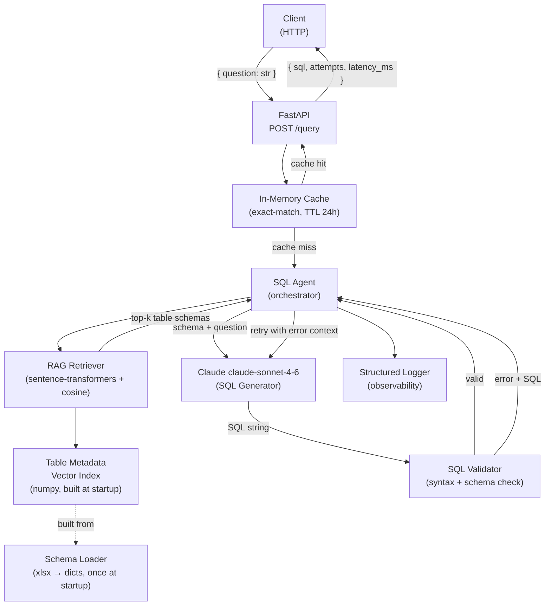
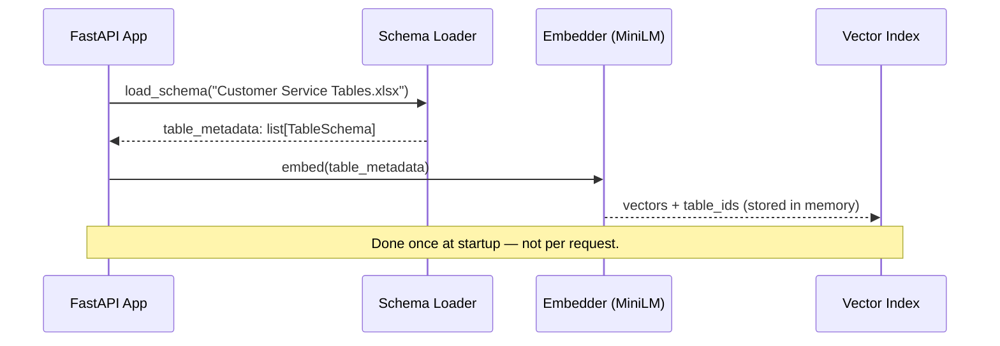
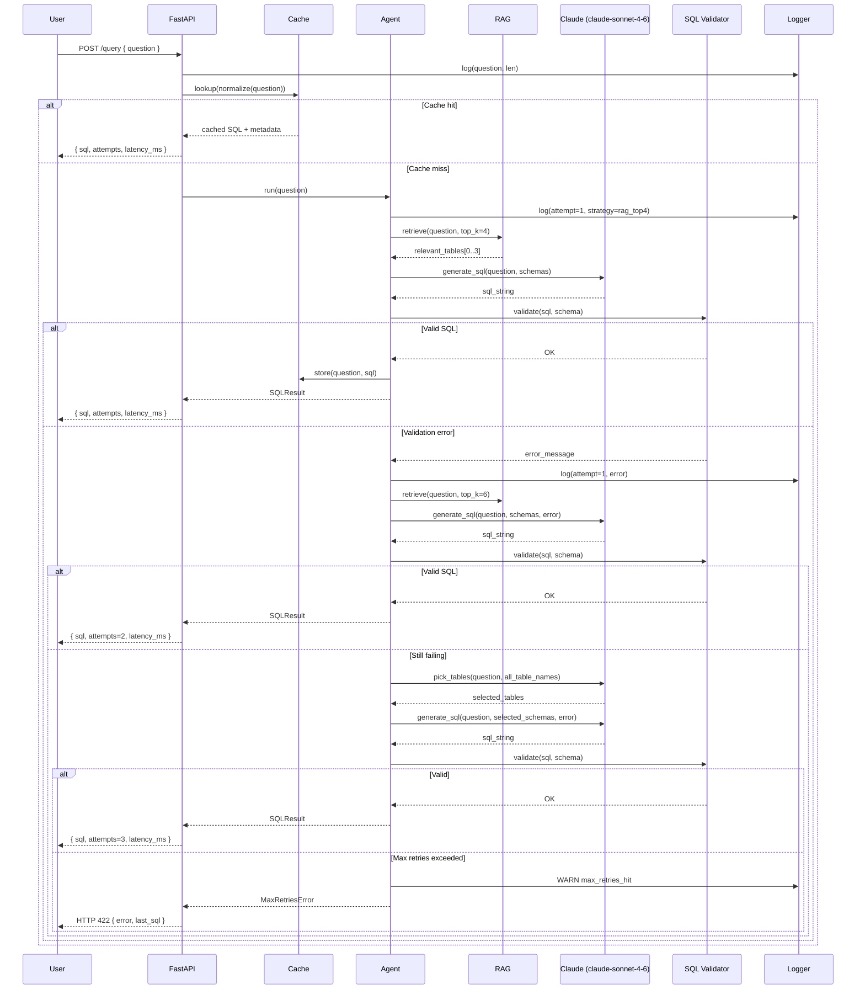
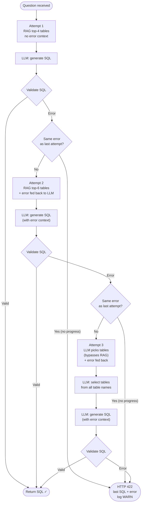
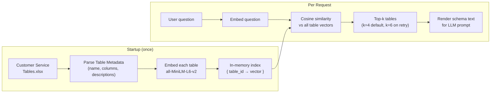
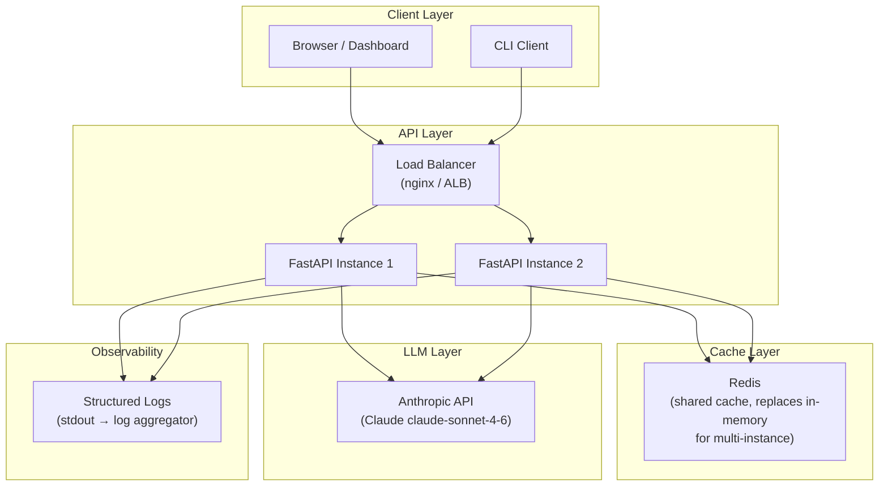

# SQL Agent — System Design

## 1. High-Level Architecture

---

## 2. Startup Sequence

---

## 3. Request Flow (Per Query)

---

## 4. Agent Loop Detail

---

## 5. RAG Pipeline Detail

---

## 7. Data Flow Summary

| Stage | Input | Output | Latency Budget |
|---|---|---|---|
| Cache lookup | Normalized question | SQL (hit) or miss | < 1 ms |
| RAG retrieval | Question embedding | Top-k table schemas | < 500 ms |
| SQL generation (attempt 1) | Question + schemas | SQL string | LLM time (excluded) |
| SQL validation | SQL string + schema | OK or error message | < 50 ms |
| SQL generation (retry) | Question + schemas + error | SQL string | LLM time (excluded) |
| **Total (excluding LLM)** | | | **< 1s target** |

---

## 8. API Contract

See [design_decisions/api_design.md](design_decisions/api_design.md) for full request/response contracts.

| Endpoint | Method | Purpose |
|---|---|---|
| `/index` | POST | Rebuild vector index — drops all previous embeddings |
| `/retrieve` | GET | Inspect which tables RAG selects for a question (no LLM) |
| `/query` | POST | Generate SQL for a natural language question |

---

## 9. Observability Signals

| Signal | Log Level | When |
|---|---|---|
| Request received | INFO | Every request |
| Cache hit | INFO | Cache hit path |
| Tables retrieved | INFO | After RAG, per attempt |
| SQL generated | DEBUG | After each LLM call |
| Validation error | WARNING | Per failed attempt |
| Same error repeated (no progress) | WARNING | Early stop triggered |
| Max retries hit | WARNING | Quality degradation signal |
| Total latency | INFO | End of every request |

---

## 10. Key Design Decisions Summary

| Decision | Choice | Why |
|---|---|---|
| Agent vs deterministic pipeline | Agentic loop | Table selection is non-deterministic; multi-step questions need planning |
| RAG scope | Schema-level only | Output is SQL, not data; row-level RAG is out of scope |
| Embedding model | `all-MiniLM-L6-v2` | CPU-only, fast, strong for short metadata text |
| Vector store | Numpy in-memory | 8 tables — no FAISS/Chroma overhead needed |
| LLM | Claude claude-sonnet-4-6 | Reliable SQL output, follows "output only SQL" instructions, available via API |
| Max retries | 3 | Balances accuracy vs. 20s latency target |
| Retry strategy | RAG-4 → RAG-6 → LLM picks | Progressively widens context to recover from retrieval misses |
| Cache | Exact-match, TTL 24h, LRU 500 | Handles repeated common queries cheaply |
| Cache miss on failure | Skip caching errors | Don't serve bad SQL from cache |

---

## 11. Production Deployment Architecture

> **Current scope:** single-instance with in-memory cache. Redis is the drop-in upgrade for horizontal scaling.
